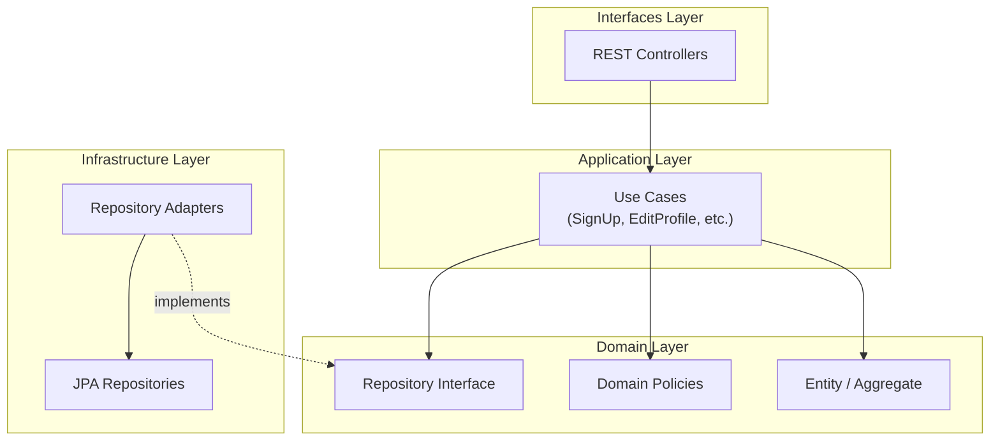

# jslog

> 개인 블로그/할일 관리 서비스

## 📋 프로젝트 개요
DDD 적용해가는 케이스 스터디 프로젝트입니다.

---

## 🛠 기술 스택

| 구분 | 기술 |
|------|------|
| **Language** | Java 21 |
| **Framework** | Spring Boot 3.5.3 |
| **ORM** | Spring Data JPA / Hibernate |
| **Security** | Spring Security + JWT |

---

## 🏗 아키텍처

### 레이어 의존성 흐름



---

### 레이어 구조

```
src/main/java/com/jslog_spring/
├── auth/                # 인증 도메인
├── member/              # 회원 도메인
├── backlog/             # 할일(백로그) 도메인
├── common/              # 공통 유틸리티
└── config/              # 설정
```

```
[domain]/
├── domain/              # 핵심 도메인 로직
│   ├── model/           # Entity, Aggregate, Value Object
│   ├── policy/          # 도메인 정책 (비즈니스 규칙)
│   ├── repository/      # Repository 인터페이스
│   └── service/         # 도메인 서비스
├── application/         # 유스케이스 (Application Service)
├── infrastructure/      # 외부 시스템 연동 (JPA 구현체)
├── interfaces/          # REST API Controller
└── exception/           # 도메인별 예외
```

---

## 🔑 도메인 구성

### Auth (인증)
- JWT 기반 로그인/로그아웃
- Refresh Token 관리
- 계정 생성/관리 (`UsernamePasswordAccount`)

### Member (회원)
- 회원가입, 프로필 수정, 닉네임 변경
- **N:M 정책 패턴** 적용 (`SignUpPolicy`, `ProfileEditPolicy`, `NicknameChangePolicy`)

### Backlog (할일 관리)
- 할일 CRUD
- 완료/미완료 처리

---

## 📈 향후 개선 계획

- [ ] **Backlog 도메인 고도화**: 상태 패턴 도입 (TODO → IN_PROGRESS → DONE → ARCHIVED)
- [ ] **Value Object 확장**: Email, Nickname, Password 등 값 객체화
- [ ] **Domain Events**: 도메인 간 느슨한 결합
- [ ] **CQRS Light**: Query/Command 분리
- [ ] **ArchUnit**: 아키텍처 테스트 자동화